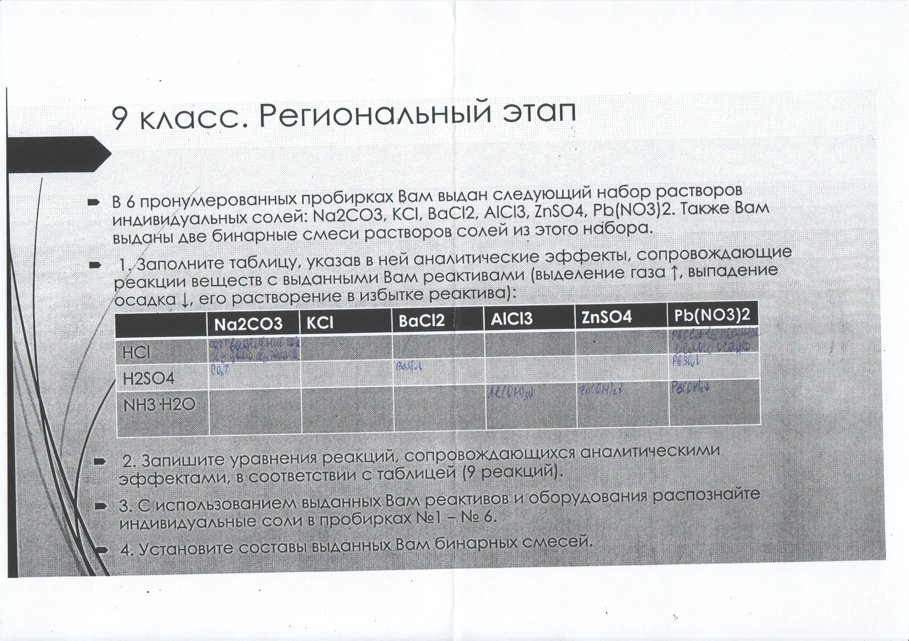

+++
title = "Задача 1"
draft = false
+++



## Таблица признаков реакций

|                   | $ \ce{Na2CO3} $ | $ \ce{KCl} $ | $ \ce{BaCl2} $ | $ \ce{AlCl3} $ | $ \ce{ZnSO4} $ | $ \ce{Pb(NO3)2} $ |
| ----------------- | --------------- | ------------ | -------------- | -------------- | -------------- | ----------------- |
| $ \ce{HCl} $      | $ \ce{CO2 v} $ выделение газа без цвета без запаха | - | - | - | - | $ \ce{PbCl2 v} $ выпадение белого осадка |
| $ \ce{H2SO4} $    | $ \ce{CO2 v} $ выделение газа без цвета без запаха | - | $ \ce{BaSO4 v} $ выпадение белого мелкокристалличесого осадка | - | - | $ \ce{PbSO4 v} $ выпадение белого осадка |
| $ \ce{NH3\*H2O} $ | - | - | - | $ \ce{Al(OH)3 v} $ выпадение белого осадка | $ \ce{Zn(OH)2 v} $ выпадение белого осадка | $ \ce{Pb(OH)2 v} $ выпадение белого осадка |

## Особенности осадков

$ \ce{PbCl2} $ - растворяется при нагревании и выпадает при последующем охлаждении

$ \ce{BaSO4} $ - не растворяется ни в кислотах, ни в щёлочах

$ \ce{Al(OH)3} $ - не растворяется в избытке аммиака

$ \ce{Zn(OH)2} $ - растворяется в избытке аммиака


$ \ce{Pb(OH)2, Sn(OH)2} $ - амфотерные гидроксиды


$ \ce{Pb(OH)2} $ - не растворяется в избытке аммиака

## Реакции
$$ \ce{Na2CO3 + 2HCl -> 2NaCl + CO2 ^ + H2O} $$
$$ \ce{Pb(NO3)2 + HCl -> PbCl2 v + HNO3} $$
$$ \ce{Na2CO3 + H2SO4 -> Na2SO4 + CO2 ^ + H2O} $$
$$ \ce{BaCl2 + H2SO4 -> BaSO4 v + 2HCl} $$
$$ \ce{Pb(NO3)2 + H2SO4 -> PbSO4 v + 2HNO3} $$
$$ \ce{AlCl3 + NH3\*H2O -> Al(OH)3 v + (NH4)2SO4} $$
$$ \ce{ZnSO4 + NH3\*H2O -> Zn(OH)2 v + (NH4)2SO4} $$
$$ \ce{Pb(NO3)2 + NH3\*H2O -> Pb(OH)3 v + NH4NO3} $$

Реакция гидроксида цинка и раствора аммиака:
$$ \ce{Zn(OH)2 + 4NH3\*H2O -> \[Zn(NH3)4\](OH)2 + 4H2O} $$
$ \ce{\[Zn(NH3)4\](OH)2} $ - гидроксид тетрааминцинка

## Определение веществ
*Карбонат натрия* определяется по выделяющемуся при реакции с кислотами бесцветному газу без запаха($\ce{CO2}$)

*Хлорид бария* определяется по выпадающему при реакции с серной кислотой белому мелкокристаллическому осадку($\ce{BaSO4}$), которые не растворяется ни в кислотах, ни в щелочах

*Хлорид алюминия* определяется по выпадающему при реакции с раствором аммиака белому осадку($\ce{Al(OH)3}$), который не растворяется в избытке раствора аммиака

*Сульфат цинка* определяется по выпадающему при реакции с раствором аммиака белому осадку($\ce{Zn(OH)2}$)
, который *растворяется* в избытке аммиака

*Нитрат свинца* определяется по выпадающим при реакциях с кислотами и с щелочами белым осадкам

*Хлорид калия* определаяется методом исключения

