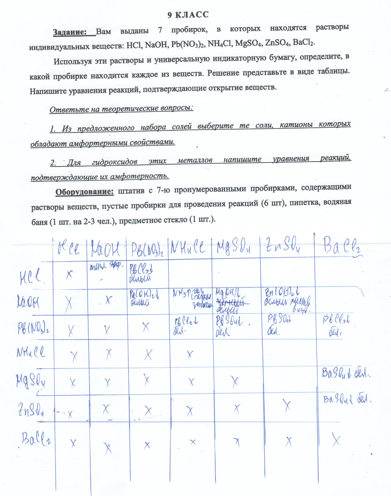

+++
title = "Задача 2"
draft = false
+++



## Таблица признаков реакций
|                 | $\ce{HCl}$ | $\ce{NaOH}$ | $\ce{Pb(NO3)2}$   | $\ce{NH4Cl}$   | $\ce{MgSO4}$     | $\ce{ZnSO4}$     | $\ce{BaCl2}$ |
| :-------------- | :--------: | :---------: | :---------------: | :------------: | :--------------: | :--------------: | :----------: |
| $\ce{HCl}$      | x          | -           | $\ce{PbCl2 v}$ белый осадок    | -              | -                | -                | -            |
| $\ce{NaOH}$     | -          | x           | $\ce{Pb(OH)2 v}$ белый осадок  | $\ce{NH3 ^}$ газ с резким запахом[^1]   | $\ce{Mg(OH)2 v}$ белый осадок | $\ce{Zn(OH)2 v}$ белый осадок | -            |
| $\ce{Pb(NO3)2}$ | $\ce{PbCl2 v}$ белый осадок | $\ce{Pb(OH)2 v}$ белый осадок | x    | $\ce{PbCl2 v}$ белый осадок | $\ce{PbSO4 v}$ белый осадок | $\ce{PbSO4 v}$ белый осадок | $\ce{PbCl2 v}$ белый осадок |
| $\ce{NH4Cl}$    | -  | $\ce{NH3 ^}$ газ с резким запахом[^1] | $\ce{PbCl2 v}$ белый осадок | x  | - | - | - |
| $\ce{MgSO4}$    | - | $\ce{Mg(OH)2 v}$ белый осадок | $\ce{PbSO4 v}$ белый осадок | - | x | - | $\ce{BaSO4}$ белый мелкокристаллический осадок |
| $\ce{ZnSO4}$    | - | $\ce{Zn(OH)2 v}$ белый осадок | $\ce{PbSO4 v}$ белый осадок | - | - | x | $\ce{BaSO4}$ белый мелкокристаллический осадок |
| $\ce{BaCl2}$    | - | - | $\ce{PbCl2 v}$ белый осадок | - | $\ce{BaSO4}$ белый мелкокристаллический осадок | $\ce{BaSO4}$ белый мелкокристаллический осадок | x |

[^1]: Из-за малой концетрации растворов, почувствовать запах аммиака может быть проблематично, поэтому стоит взять индикаторную бумагу, смочить её в воде и накрыть ею пробирку, в которой может образоваться аммиак. При наличии водяной бани, желательно поставить пробирку нагреваться.

## Особеннсти осадков

$ \ce{PbCl2} $ - растворяется при нагревании и выпадает при последующем охлаждении


$ \ce{Pb(OH)2, Sn(OH)2} $ - амфотерные гидроксиды


$ \ce{Pb(OH)2} $ - растворяется в избытке щёлочи

$ \ce{Mg(OH2)} $ - не растворяется в избытке щёлочи

$ \ce{Zn(OH)2} $ - растворяется в избытке щёлочи

$ \ce{BaSO4} $ - не растворяется ни в кислотах, ни в щёлочах

## Реакции

$$ \ce{2HCl + Pb(NO3)2 -> PbCl2 v + 2HNO3} $$
$$ \ce{2NaOH + Pb(NO3)2 -> Pb(OH)2 v + 2NaNO3} $$
$$ \ce{NaOH + NH4Cl -> NH3 ^ + H2O + NaCl} $$
$$ \ce{2NaOH + MgSO4 -> Mg(OH)2 v + Na2SO4} $$
$$ \ce{2NaOH + ZnSO4 -> Zn(OH)2 v + Na2SO4} $$
$$ \ce{Pb(NO3)2 + 2NH4Cl -> 2NH4NO3 + PbCl2 v} $$
$$ \ce{Pb(NO3)2 + MgSO4 -> PbSO4 v + Mg(NO3)2} $$
$$ \ce{Pb(NO3)2 + ZnSO4 -> PbSO4 v + Zn(NO3)2} $$
$$ \ce{Pb(NO3)2 + BaCl2 -> PbCl2 v + Ba(NO3)2} $$
$$ \ce{MgSO4 + BaCl2 -> BaSO4 v + MgCl2} $$
$$ \ce{ZnSO4 + BaCl2 -> BaSO4 v + ZnCl2} $$

Реакция $\ce{Zn(OH)2}$ с $\ce{NaOH}$(в растворе)
$$ \ce{Zn(OH)2 + 2NaOH -> Na2[Zn(OH)4]} $$

Реакция $\ce{Pb(OH)2}$ с $\ce{NaOH}$(в растворе)
$$ \ce{Pb(OH)2 + NaOH -> Na2[Pb(OH)4]} $$

## Определение веществ

$\ce{HCl}$ - окрашивает индикатор в красный цвет

$\ce{NaOH}$ - окрашивает индикатор в синий цвет

$\ce{Pb(NO3)2}$ - из-за гидролиза может окрасить индикатор в красный цвет; реагирует со всеми предложенными реактивами, выпадает белый осадок хлорида/сульфата/гидроксида свинца

$\ce{NH4Cl}$ - из-за гидролиза может окрасить индикатор в красный цвет; при реакции с щёлочью выделяется аммиак(газ с резким запахом)[^1]

$\ce{MgSO4}$ - при реакции с щёлочью выпадает белый осадок, который не растворяется в избытке щёлочи

$\ce{ZnSO4}$ - при реакции с щёлочью выпадает белый осадок, который растворяется в избытке щёлочи

$\ce{BaCl2}$ - при реакции с сульфатами выпадает белый иелкокристаллический осадок
